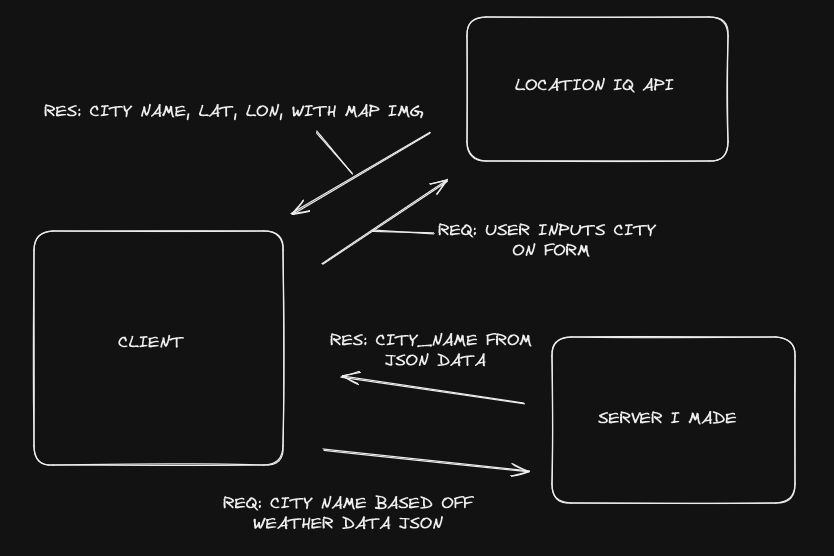
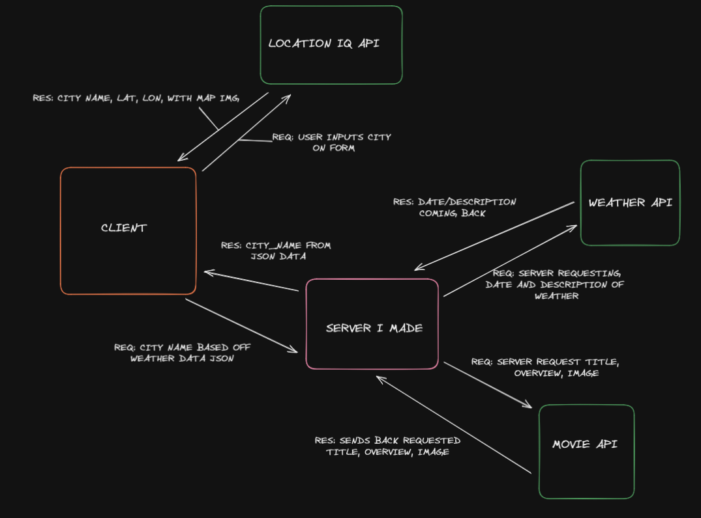

# City-Explorer-Api

**Author**: Reece R.
**Version**: 1.0.0 (increment the patch/fix version number if you make more commits past your first submission)

## Overview

Building a backend server to access a weather API to allow our city-explorer React built page to be able to get weather data sent on the requested cities by user.

## Getting Started

Build a backend server using npm init in terminal to get your package.json started.  Ensure you have express, dotenv, and cors installed to allow for your server to run and have appropriate middleware.  Make sure you have your gitignore(specifically ensure .env is included in this file) and eslintrc file.
Later on we will be connecting to a weather API but for now there is a local weather json file you can use from the 301d97 class repo.

## Architecture

### Feature One: Building a server & Connecting to Front End

Estimate of time needed to complete: 120 to 180 minutes (~ 2 to 3 hours)

Start time: 12:30

Finish time: 18:30

Actual time needed to complete: 6 hours

### Feature Two: Modularizing End Points

Estimate of time needed to complete: 15 minutes

Start time: 12:00

Finish time: 12:15

Actual time needed to complete: 15 minutes

### Feature Three: Adding Cache

Estimate of time needed to complete: 30 minutes

Start time: 12:00

Finish time: 12:20

Actual time needed to complete: 20 minutes

I am using JavaScript, React, HTML, CSS for the whole application.  For this specific portion we are using express to run the server, dotenv, and cors as middleware.

## Change Log

03/22/2023 17:40 - Server is connected to Weather API(WeatherBit) and Movie API (The Movie DB)

03/23/2023 12:50 - Server is modularized

03/24/2023 12:25 - Cache is implemented on both modules

## Credit and Collaborations

Audrey P from Code Fellows 301, the spirit guide and teacher of the class.
